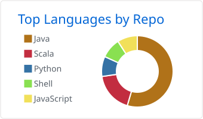
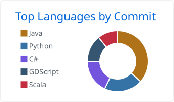

# Hi, I’m @ArpaDeveloper!
*Software & Systems Engineering Student | Software Developer | Software hobbyist*

I like working on different projects and optimizing things. I have been coding since 2017.

> [!NOTE]
> If this is TLDR, just check my [website](https://arpadeveloper.github.io/). 

## *Skills* :hammer:
*Scripting*

`C`,`Rust`,`Python`,`JavaScript`,`C#`,`C++`,`Scala`,`Java`,`SQL`

*Tools & Software*

`VS Code`,`GitHub`,`AWS`,`Unity`,`Google Apps Scripting`, `Docker`, `JetBrains IDEs`, `Azure`

*Systems & Hardware*

`Linux`,`Windows`,`PC assembly & troubleshooting`

## *Projects* :package:
### *Lofirunner* (Self-published game)

Click

Lofirunner is a single-player 3D speedrunning game, where you speed your way through space. Made with Unity and C#. Available on [Steam](https://store.steampowered.com/app/2111080/Lofirunner/). Made completely from start to finish by me (excluding music).

`Key Features`
- Built with Unity engine.
* Core gameplay mechanics, movement systems, UI logic, and game state handling implemented in C#.
+ Steam integration (Steam Achievements).

### *Portfolio Website* (Hosted in Github)

Click

 
I made my portfolio website with HTML/CSS and javasript. Currently looking for ways to update it. Check it out [here](https://arpadeveloper.github.io/). 

`Key Features`
- Built with HTML/CSS & Javascript.
* Hosted on GitHub Pages.
+ "Visualized CV"

### *Junction 2025 Project* (End-to-End, AI-driven logistics platform)

Click

 
AI-Driven logistic platform made during Junction 2025 Hackathon (72 hours). Made with 4 other team members. Check it out [here](https://github.com/eeliogata/junction-2025).

`Key Features`
- Conversational, multilingual, decision-making AI agent powered by Gemini.
*  AI assisted management platform.
+ Predictive analysis machine learning model trained on Google Cloud.

## *Stats*

  <picture>
    <source
      media="(prefers-color-scheme: dark)"
      srcset="profile-summary-card-output/github_dark/1-repos-per-language.svg">
    
  </picture>
   <picture>
    <source
      media="(prefers-color-scheme: dark)"
      srcset="profile-summary-card-output/github_dark/2-most-commit-language.svg">
    
  </picture>

## Socials :eyes:
[Linkedin](https://www.linkedin.com/in/aarni-viljanen/) & [Portfolio](https://arpadeveloper.github.io/)

